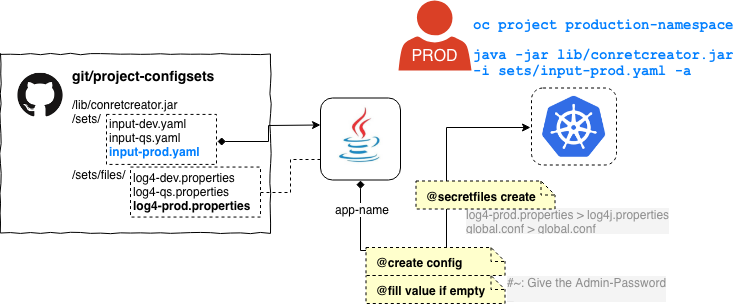

# K8 ConRet Creator


##### Stable-Version: 2.5
##### Beta-Version: 2.6

The ConRetCreator is a tool to manage your enivronments in your k8-store as kubernetes or openshift. 
It will help you to create sets of secrets and configmaps from a defined set as yamlinut.
If a value is empty, CLI will ask you interactive for this value or take it from exported ENV-Variable. 

With this logic definitions can be stored and distributed in a VCS. Furthermore, it can be avoided that passwords, for example, are not stored.

### Usecases

#### Usecase-1:
- You may not store your KeyValues in a file system or VCS system for compliance or other reasons. 
- And/or these KVS may only be set by certain persons.

#### Usecase-2:
- You have some files that are stage-specific, but are have the same name at runtime.

#### Conclusion
To add values to your store, you need your **input file**, maybe your dependent files and Java-based tool "**conretcreator.jar**". 
In this case, you can give this all by an email or by vcs to a other guy (Production) to setup your Store.





## Install
```
    git clone https://github.com/dockermgeo/k8s-conretcreator.git
    make install
    # TODO -> define Input-Yaml
```

## Dependencies
- JDK 1.8 or higher
- Lower versions than **2.3** of conretcreator depends a installed **oc** or **kubectl** on your System.
- Version **2.4**, function **-f**/**--secrets-fs** depends also oc-installation   

## SYNTAX
``` 
    java -jar conretcreator.jar -<option> -i <INPUTFILE(s)>
```

## OPTIONS


| Option        | Description |
| ------------- |-------------| 
| -c      | Create/Replace a Secret or ConfigMap |
| **-i FILE-A FILE-B**      | **Inputfile or -files** in YAML-Format |
| -h      | help, show usage|
| -f      | Create/Replace Secrets from filesystem |
| -x      | export/display section defintion for container-env |
| -z      | debug - do not delete any generated files and show commands |


More ***Versions*** a distributed in folder [releases/](releases/). 
You can use our Scripts, "run.sh" for OSx/Linux or "run.bat" on Windows.


### Input-YAML

Empty **values** will filled by CLI.

```
    clustername: "https://cluster-dev.mgeo.de"
    namespace: "play-with-configs"
    name: "mgeo-dev-io"
    # kind: Secret or ConfigMap
    kind: Secret
    
    # Datablock, will include your definitions
    data:
      - name: loglevel
        value: debug
        desc: "Loglevel for the APP"
      - name: username
        value: admin
        desc: "Name of User"
      - name: password
    # if value is empty, CLI will ask for it
        value: ""
        desc: "Password will set by CLI"

    # FILES as secret
    files:
    # relativepath to this file
      - src: "files/stages/log4j-prod.properties"
        target: "log4j.properties"
      - src: "files/debugger.properties"
    # no target means, take the original name
        target: ""
```

## Get output for k8s-definiton 

With the **parameter -x** the necessary Templatedefinition can be output to Stdout.

```
    containers:
    .
    .
    env:
    - name: LOGLEVEL
      valueFrom:
      ... 
```

Usage as secret
```
    - name: LOGLEVEL
      valueFrom:
        secretKeyRef:
            name: mgeo-dev-secs
            key: loglevel
```

Usage as configmap
```
    - name: LOGLEVEL
      valueFrom:
        configMapKeyRef:
            name: mgeo-dev-cfg
            key: loglevel
```

Usage secrets from files
 ```
    env:
        volumeMounts:
            - name: mgeo-dev-volume
              mountPath: /etc/secrets
              readOnly: true
    volumes:
        - name: mgeo-dev-volume
            secret:
                secretName: mgeo-dev

 ```
 
 
 
## Example / Usecase

I defined some [special Variable](src/main/resources/) values in fr-EXAMPLE-<***STAGENAME***>.yaml and some different [files](src/main/resources/files) who I like to use in different runstages.
Show as it works.

```
./run.sh -c -s -i sets/EXAMPLE-dev.yaml 

Working on:
	- CLUSTER: dev.mgeo.local
	- PROJECT: mgeo-dev

Give me the Adminpassword
supergeheim
[ok]	Creating secret 'mgeo-dev'
[ok]	Creating filesecret 'mgeo-dev-files'

```

The process won't ask on CLI if you've set the defined key by an exported ENV variable. 
